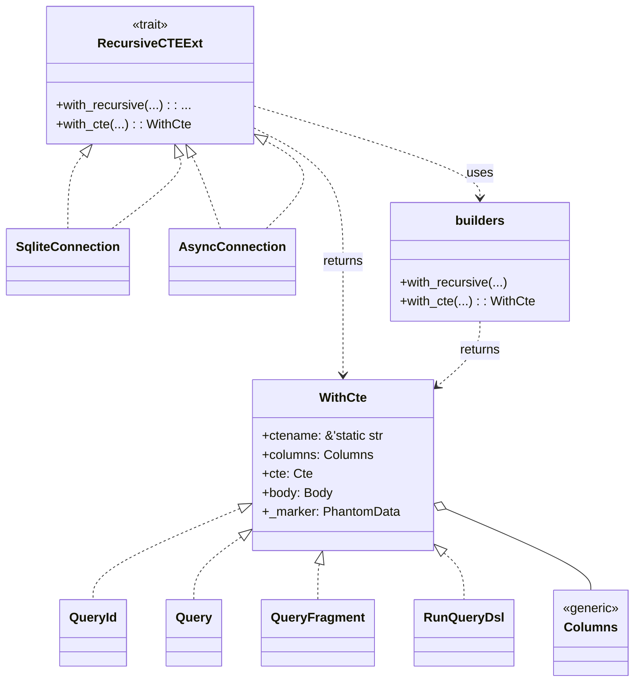

# diesel_cte_ext

`diesel_cte_ext` adds small helpers for building Common Table Expressions
([CTEs](https://www.postgresql.org/docs/current/queries-with.html#QUERIES-WITH-RECURSIVE))
with Diesel. The crate exports a connection extension trait providing two
builders: `with_recursive` for recursive CTEs and `with_cte` for plain `WITH`
blocks.

```rust
use diesel::dsl::sql;
use diesel::sql_types::Integer;
use diesel::sqlite::SqliteConnection;
use diesel_cte_ext::{RecursiveCTEExt, RecursiveParts, seed_query, step_query};
// Count integers from 1 through 5 using a recursive CTE

let rows: Vec<i32> = SqliteConnection::with_recursive(
    "t",
    &["n"],
    RecursiveParts::new(
        seed_query!(sql::<Integer>("SELECT 1")),
        step_query!(sql::<Integer>("SELECT n + 1 FROM t WHERE n < 5")),
        step_query!(sql::<Integer>("SELECT n FROM t")),
    ),
)
    .load(&mut conn)?;

// Plain CTE using `with_cte`
let val: i32 = SqliteConnection::with_cte(
    "x",
    &["n"],
    sql::<Integer>("SELECT 42"),
    sql::<Integer>("SELECT n FROM x"),
)
    .get_result(&mut conn)?;
```

The `seed_query!` and `step_query!` macros wrap regular Diesel expressions so
they can be embedded in the recursive CTE builder without implementing
`QueryFragment` manually. Alternatively, call `.into()` on the expression to
convert it into a `QueryPart`.

`Columns<T>` couples the runtime column names with a compile-time tuple of
Diesel column types. For ad-hoc CTEs use a string slice directly or
`Columns::raw`. When working with schema-defined tables you can build the list
via the provided helper macros.

```rust
use diesel_cte_ext::{columns, table_columns};
use crate::schema::users;

let user_cte = SqliteConnection::with_recursive(
    "u",
    columns!(users::id, users::parent_id),
    RecursiveParts::new(todo!(), todo!(), todo!()),
);

let table_cte = SqliteConnection::with_recursive(
    "u",
    table_columns!(users::table),
    RecursiveParts::new(todo!(), todo!(), todo!()),
);
```

The resulting CTE `t` contains the following rows:

| n   |
| --- |
| 1   |
| 2   |
| 3   |
| …   |

When the `async` feature is enabled, import `diesel_async::RunQueryDsl` and
await the query as follows:

```rust
use diesel::dsl::sql;
use diesel::sql_types::Integer;
use diesel_cte_ext::{RecursiveCTEExt, RecursiveParts, seed_query, step_query};
use diesel_async::RunQueryDsl;
use diesel::sqlite::SqliteConnection;

let rows: Vec<i32> = SqliteConnection::with_recursive(
        "t",
        &["n"],
        RecursiveParts::new(
            seed_query!(sql::<Integer>("SELECT 1")),
            step_query!(sql::<Integer>("SELECT n + 1 FROM t WHERE n < 5")),
            step_query!(sql::<Integer>("SELECT n FROM t")),
        ),
)
    .load(&mut conn)
    .await?;
```

These macros allow building the CTE entirely with Diesel's query DSL and avoid
manually writing SQL strings.

The builder works with either SQLite or PostgreSQL depending on the enabled
Cargo feature. It can be used with synchronous or asynchronous Diesel
connections.

## Capabilities

- Construct a single recursive CTE with a seed query, step query and body.
- Build a simple `WITH` block via `with_cte`.
- Tested with both SQLite and PostgreSQL back ends.
- Compatible with Diesel 2.x synchronous and `async` connections.

## Diagram



## Limitations

- Only supports a single CTE block.
- No integration with Diesel's query DSL or schema inference.
- Crate is unpublished and APIs may change without notice.

## Next steps

Future improvements could include better integration with Diesel's query builder
and support for multiple chained CTEs.

## Caveats

This crate is experimental. Error handling is minimal and the API may evolve.
Use at your own risk.
