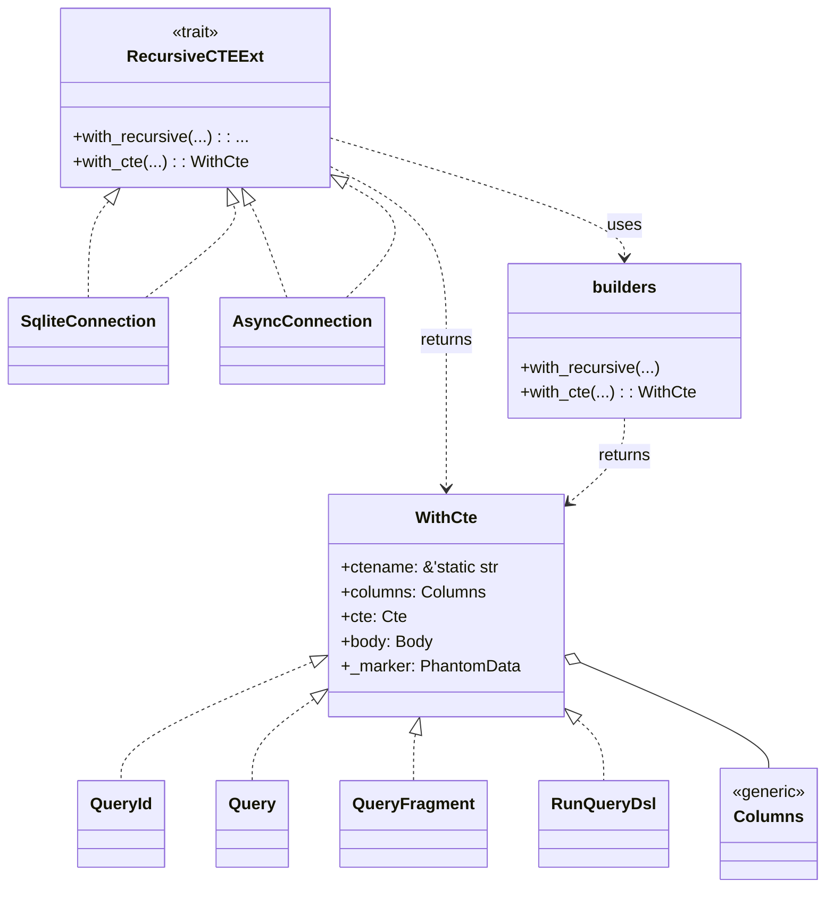

# diesel_cte_ext Design

diesel_cte_ext provides small helpers for building Common Table Expressions
(CTEs) with Diesel. The crate exposes builders for both recursive and
non-recursive CTE blocks. A connection extension trait makes those builders
available on synchronous and asynchronous connections.

## Architecture

The `WithCte` type stores the CTE name, columns, and query fragments for the
common table expression. The builders produce a `WithCte` instance that can be
executed using Diesel's `RunQueryDsl`.
