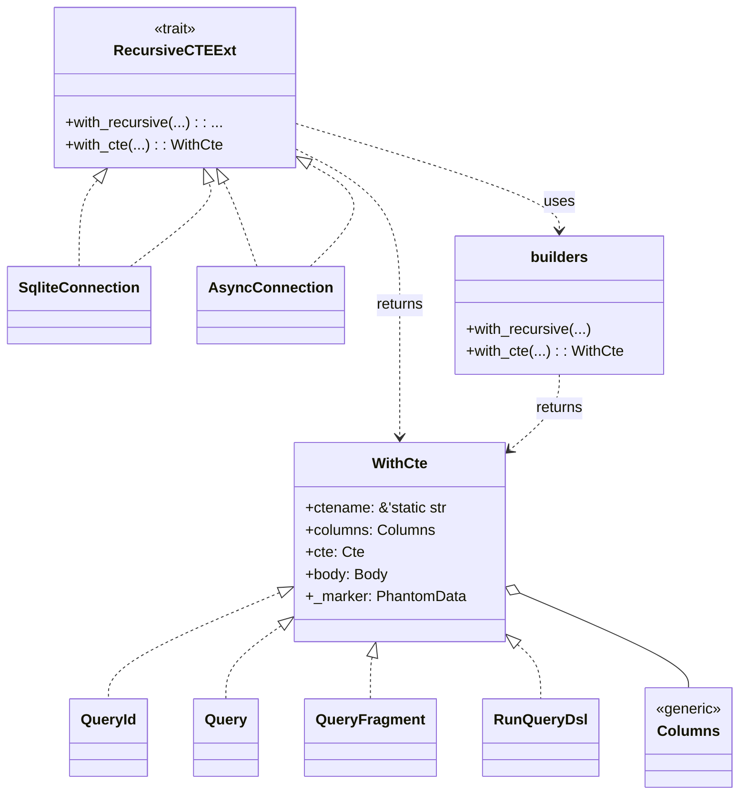

# diesel-cte-ext (`diesel_cte_ext`) Design

diesel_cte_ext provides small helpers for building Common Table Expressions
(CTEs) with Diesel. The crate exposes builders for both recursive and
non-recursive CTE blocks. A connection extension trait makes those builders
available on synchronous and asynchronous connections. As of 11 November 2025
MXD no longer vendors its own copy; the repository depends on the crates.io
release `diesel-cte-ext` v0.1.0, so the upstream project carries the code and
tests while MXD simply integrates it.

## Architecture

The `WithCte` type stores the CTE name, columns, and query fragments for the
common table expression. The builders produce a `WithCte` instance that can be
executed using Diesel's `RunQueryDsl`.

## Feature flags

- `async` is always enabled, so MXD can compose recursive queries on both the
  synchronous and asynchronous Diesel connection types exposed by
  `diesel_async`.
- Backend-specific features (`sqlite`, `postgres`) are toggled via the main
  crate’s feature flags and forwarded to `diesel-cte-ext` through the
  `diesel-cte-ext/{backend}` feature gates.
- The dependency is declared once in the root `Cargo.toml` under
  `[workspace.dependencies]`, ensuring every package within the workspace pulls
  identical features (namely `default-features = false` plus `async`).

This consolidation prevents silent divergences between crates and documents how
`diesel-cte-ext` should be configured at the manifest level.
