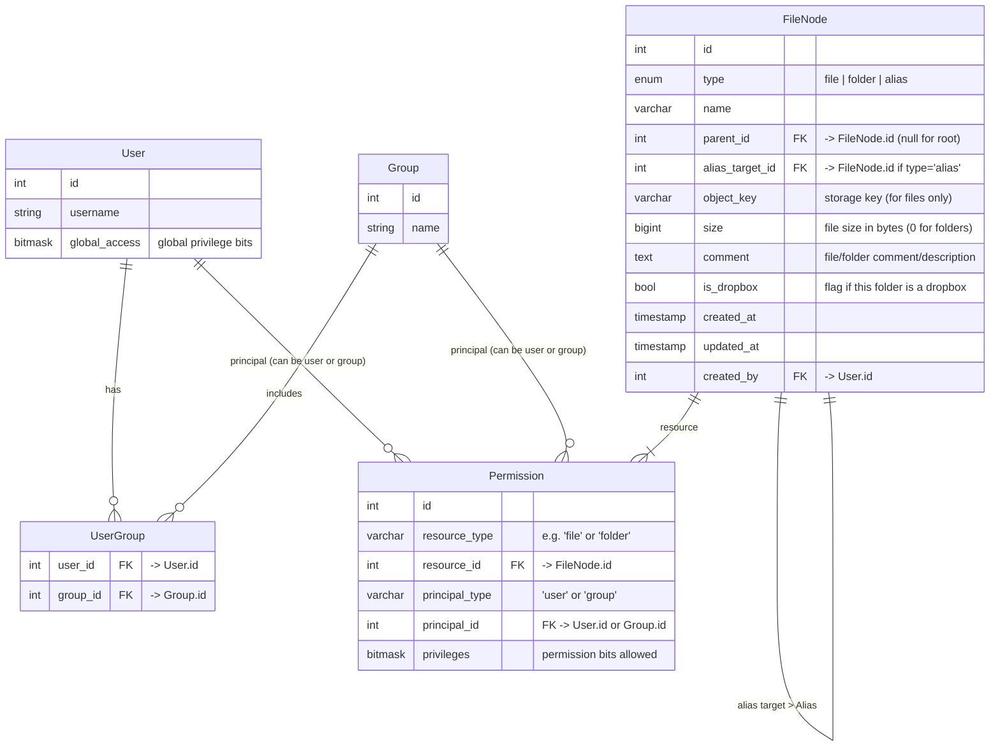

# Implementing a Hotline-Style File Sharing Component (Developer Guide)

## Introduction

This guide describes how to implement the **file-sharing component** of a Hotline-inspired BBS server. It covers the design and implementation of file transactions analogous to Hotline protocol codes **200–213** – including directory listing, file upload/download (with resume support), folder creation/deletion, moving/renaming, aliasing, folder upload/download, and file metadata updates. We focus exclusively on file sharing, **reusing the existing user/ACL architecture** from the broader application. Our implementation is backend-agnostic, using Rust’s `object_store` crate for storage so it can target AWS S3, Azure Blob, local files, etc. We will address how to map a classic hierarchical folder tree onto the flat keyspace of object storage, handle resumable transfers via byte ranges and multipart uploads, model **aliases**, **dropboxes**, **upload folders**, and **file comments** in the database, and enforce **folder-level and per-file ACLs**. We also discuss trade-offs in metadata synchronization, consistency, and performance.

## Protocol Alignment with Hotline Transactions (200–213)

Hotline defined a set of binary transactions for file operations, which our server will emulate at a high level. The relevant operations and their Hotline transaction IDs are:

* **GetFileNameList (200)** – List directory contents.
* **DownloadFile (202)** – Download a single file (supports resume).
* **UploadFile (203)** – Upload a single file (supports resume).
* **DeleteFile (204)** – Delete a file (or folder).
* **NewFolder (205)** – Create a new folder.
* **GetFileInfo (206)** – Retrieve file/folder info (size, dates, comment, etc).
* **SetFileInfo (207)** – Set file/folder info (e.g. rename or comment).
* **MoveFile (208)** – Move or rename a file/folder.
* **MakeFileAlias (209)** – Create an alias (link) to a file.
* **DownloadFolder (210)** – Download an entire folder (with subfolders).
* **UploadFolder (213)** – Upload an entire folder (including subfolders).

Our server will implement analogous commands for these operations. Each operation will validate the user’s access rights and then perform the necessary database and storage actions. We ensure that our design aligns with Hotline’s features (like partial transfers and aliases) while using modern technologies for robustness and scalability.

## System Architecture Overview

**Core Components:** The file-sharing subsystem consists of a relational **database** for metadata & permissions and an **object storage** service for file content. The server logic (written in Rust) mediates between client requests, the DB, and the object store: for example, a download request triggers a DB lookup and an object store read stream. By leveraging the Rust **`object_store`** crate, we can easily swap underlying storage (local filesystem, S3, Azure, etc.) without code changes. All storage access is asynchronous and stream-oriented for efficiency. The **ACL and user management** are part of the broader application schema and are reused here – meaning file/folder permissions are stored and enforced using the same tables and logic that manage chat or news access rights, rather than a separate silo.

**Workflow Example:** When a client requests a file (DownloadFile), the server will 1) authenticate and check ACLs, 2) find the file’s metadata in the DB (name, size, object key, etc.), and 3) stream the file content from the object store to the client (possibly in Hotline’s “flattened file” format). Uploads follow the reverse: the server receives data and streams it into the object store (possibly via multipart upload for large files) and then records metadata in the DB. Directory listings read from the DB and return a list of entries with attributes. All operations use the DB as the source of truth for directory structure and metadata, which ensures strong consistency for listings and ACL enforcement. The object store holds only file data and is treated as a flat blob store.

**Storage Abstraction:** We do *not* rely on filesystem semantics or cloud-specific APIs directly – instead, we use the abstraction provided by `object_store::ObjectStore`. This trait provides methods to put and get objects, list with prefixes, and handle multipart uploads in a uniform way. This lets the same code run against local disk, S3, Azure, Google Cloud, etc., configured by a URL or builder at runtime. All file reads/writes are done through this API, keeping our implementation backend-agnostic.

The diagram below shows the core data model (ERD) for the file-sharing component, including how it ties into the user/permission system.

## Data Model and Schema

To model files, folders, and related features, we define a **FileNode** table representing an item in the hierarchy (which might be a folder, a file, or an alias pointer). We also integrate with existing **User**, **Group**, and **Permission/ACL** tables from the application for access control. Each file or folder can have fine-grained ACL entries (linking to users or groups) in the shared permissions table. We include fields for metadata like size, timestamps, and comments. Below is the ER diagram in Mermaid notation:



In this model:

* **FileNode** is a unified table for files, folders, and aliases. Each entry has a `type` indicating what it is. Every node (except the root) has a `parent_id` linking to a folder. File entries have an `object_key` pointing to data in object storage, a `size`, and perhaps MIME/type info (not shown here). Folder entries have no `object_key` (since they contain no data object) and size may be 0 or used for count. Alias entries have an `alias_target_id` referencing another FileNode (the original file). All nodes can have a `comment` (Hotline allowed user comments on files/folders). `is_dropbox` marks a folder as a **drop box** (a special upload-only folder – explained later). We also record creation timestamps and the user who created/uploaded the file.
* **Permission** is the shared ACL table (simplified for our context). It can reference any resource in the system; for file sharing we use it to store folder-level or file-level permissions. Each entry grants certain `privileges` (bitmask flags) to a principal (which can be an individual User or a Group). The privileges bits correspond to actions like download, upload, delete, etc., as defined by the application (following Hotline’s privilege definitions). For example, bit 2 might be “Download File”, bit 1 “Upload File”, bit 0 “Delete File”, etc., matching Hotline’s Access Privileges. A **folder-type privilege** in Hotline can be applied per folder via such entries. If no specific Permission entry exists for a given file or folder, the user’s global access rights (stored in `User.global_access` bitmask) apply as default.
* **User, Group, UserGroup** are part of the existing system to manage accounts and group membership. They are included here to illustrate that permissions can be granted to groups as well as users. The `Permission.principal_type` and `principal_id` together refer to either a user or a group. For example, you could give a “Guests” group download rights to a particular folder, or assign an individual user upload rights.

Below is an example SQL DDL that implements this schema:

```sql
-- Users and Groups (from shared schema)
CREATE TABLE User (
    id             SERIAL PRIMARY KEY,
    username       VARCHAR(50) UNIQUE NOT NULL,
    global_access  BIGINT NOT NULL DEFAULT 0,   -- 64-bit access privileges bitmap:contentReference[oaicite:22]{index=22}:contentReference[oaicite:23]{index=23}
    -- ... other user fields (password hash, etc) ...
);
CREATE TABLE "Group" (
    id    SERIAL PRIMARY KEY,
    name  VARCHAR(50) UNIQUE NOT NULL
);
CREATE TABLE UserGroup (
    user_id  INT REFERENCES User(id) ON DELETE CASCADE,
    group_id INT REFERENCES "Group"(id) ON DELETE CASCADE,
    PRIMARY KEY (user_id, group_id)
);

-- File and Folder metadata
CREATE TABLE FileNode (
    id               SERIAL PRIMARY KEY,
    type             VARCHAR(10) NOT NULL CHECK(type IN ('file','folder','alias')),
    name             VARCHAR(255) NOT NULL,
    parent_id        INT REFERENCES FileNode(id) ON DELETE CASCADE,
    alias_target_id  INT REFERENCES FileNode(id) ON DELETE CASCADE,
    object_key       TEXT,               -- NULL for folders and aliases
    size             BIGINT NOT NULL DEFAULT 0,
    comment          TEXT,
    is_dropbox       BOOLEAN NOT NULL DEFAULT false,
    created_at       TIMESTAMPTZ NOT NULL DEFAULT now(),
    updated_at       TIMESTAMPTZ NOT NULL DEFAULT now(),
    created_by       INT REFERENCES User(id),
    -- Ensure uniqueness of name within a folder:
    UNIQUE(parent_id, name)
);
-- (Optionally, create a root folder entry with id=1 and parent_id NULL to represent the root directory.)

-- Permissions/ACL (shared across app)
CREATE TABLE Permission (
    id             SERIAL PRIMARY KEY,
    resource_type  VARCHAR(20) NOT NULL,   -- e.g. 'file' or 'folder'
    resource_id    INT NOT NULL,          -- references FileNode(id)
    principal_type VARCHAR(10) NOT NULL,  -- 'user' or 'group'
    principal_id   INT NOT NULL,          -- User.id or Group.id
    privileges     BIGINT NOT NULL,       -- bitmask of allowed actions
    UNIQUE(resource_type, resource_id, principal_type, principal_id)
);
-- (For file sharing, resource_type might be 'file' or 'folder'; both map to FileNode IDs.)
```

This schema allows us to represent the complete file system hierarchy and access controls:

* A folder’s contents are FileNode entries with that folder’s ID as their parent\_id. We can traverse parent\_id links to resolve full paths or to enforce inherited rules.
* An alias is simply a FileNode of type 'alias' pointing to another FileNode (its target). It has its own name and parent (so it appears in a directory), but no object\_key or size of its own – it uses the target’s data.
* A dropbox is indicated by `is_dropbox=true` on a folder (and likely also by specific Permission entries on that folder to restrict access; see **Access Control** below).
* Upload folders (for the *UploadFolder* transaction) are not a special type in the schema – they are created dynamically as normal folders when a user initiates a folder upload. The process of handling folder uploads is covered in the implementation sections, but no additional static schema is needed.
* File comments are stored in the `comment` field of FileNode. Both files and folders can have comments (Hotline had a separate privilege for setting folder comments vs file comments, which we can enforce via privileges bits 28 and 29 respectively).

All critical fields are indexed or constrained for performance and integrity (e.g. unique name per folder, foreign keys to cascade deletions of sub-items, etc.). We now discuss how this schema is used in implementation for each operation.

## Hierarchical Structure Mapping to Object Storage

Object storage systems use a **flat key namespace** – there is no true directory hierarchy on the backend. Any notion of folders is typically an illusion maintained by naming conventions and prefix queries. For example, in an S3-like store, an object key `"docs/reports/file.pdf"` might *appear* as if `docs` and `reports` are folders, but actually it’s just a single key with slashes in its name. Folders have no intrinsic metadata in object stores – their existence is implied by object keys. Therefore, we must map our hierarchical Hotline-style file system onto a flat keyspace. We do this as follows:

* **Database as Source of Truth:** The **FileNode** hierarchy in the database is the authoritative representation of directories, subdirectories, and file names. We do **not** rely on the object store to list or organize directories. This allows us to attach metadata (permissions, comments, etc.) to directories themselves, which object stores cannot do. Folders in our system are logical constructs (entries in the DB) and need not correspond to any physical object in the store.
* **Object Key Design:** For actual file content, we generate an **object key** for each file stored. A simple strategy is to use a path-like key mirroring the file’s path (e.g., combine parent folder names and filename). However, **we prefer using a unique identifier** (like the FileNode `id` or a UUID) as the object key, decoupling it from the human-readable path. This approach avoids expensive renames or copies in storage when a file is moved or renamed in the hierarchy. For example, if file *"Manual.pdf"* (id 42) is stored with key `"files/42.pdf"`, moving it to a different folder in the DB does not require moving the object or changing the key. In contrast, if we had used `"Docs/Manual.pdf"` as the key, renaming the "Docs" folder would require renaming every object under it. By mapping each file to a **stable flat key**, we keep storage operations simple and atomic (create/delete) and handle renames purely in metadata.
* **Folder Listing:** When a client requests a directory listing (GetFileNameList), the server queries the DB for FileNodes with `parent_id` = that folder’s ID. The object store is not consulted at all for listing; thus, we are immune to any object store listing consistency issues and can include additional info (file type, size, comments) directly from the DB. If using ID-based object keys, the server might on occasion verify the object exists (e.g., using a HEAD request via object\_store for sanity), but that’s optional and can be done in background audits. If we used path-based keys, we could use object\_store’s `list` with a prefix filter, but we would still need the DB to get comments and permissions, so it's simpler to rely entirely on the DB for structure.
* **Folder Creation and Deletion:** Creating a folder (NewFolder command) results in a new FileNode of type 'folder' in the DB. **No object is created in the store** for it (consistent with object stores not needing a placeholder object for directories). Deleting a folder in the DB (if empty or via recursive delete) will involve deleting all descendant FileNode records and all associated objects for files – we can use object\_store’s delete functionality for each file’s object. Deletion of a folder in object storage is thus just deletion of the contained objects (since the folder itself is conceptual).
* **Path Resolution:** Since clients and protocol refer to files by “path” (folder names + filename), the server will need to resolve those into a FileNode ID. This can be done with recursive DB queries (e.g., find child by name under parent, etc.). To optimize, one could store a full path string or a path hash for quick lookups, but that complicates updates on move/rename. Instead, we can traverse stepwise or use indexed queries on parent+name (the unique constraint helps here). For example, to find `"/Uploads/2025/Report.pdf"`, we would find the root “Uploads” folder, then find child “2025” under it, then “Report.pdf” under that. These lookups are typically fast with proper indexes. The final file node gives us the `object_key` to access the content.

This mapping strategy ensures we maintain a **hierarchical view** for users and ACLs, while the underlying storage remains a flat pool of objects identified by opaque keys. It leverages the strengths of each: the database handles relationships and rich metadata, and the object store handles large binary data efficiently.

## File Operations Implementation

We now detail how each major file-sharing command is implemented in the backend, following the schema and architecture above. Each operation is described with its permission checks, database actions, and storage interactions. All operations use Rust’s async features and the `object_store` interface for I/O, enabling high-throughput, non-blocking transfers.

### Directory Listing – *GetFileNameList (200)*

When the client requests a directory listing of a given path (or root), the server performs:

1. **Path Resolution:** Determine which folder to list. If the request includes a path, we lookup the FileNode for that folder. If no path given, we use the root folder (by convention, the root might be a FileNode with parent\_id = NULL).
2. **Permission Check:** Ensure the user has rights to list/browse this folder. Hotline did not have a separate “list folder” privilege bit, but effectively, to see files one needed Download permission on that folder or the special *View Drop Boxes (30)* privilege for hidden dropboxes. In our system, we can treat listing as requiring at least read access. If the folder is a dropbox (`is_dropbox=true`) and the user lacks the special view privilege, we will return an empty list (the folder will appear empty to them, even though files might be present) – this mimics Hotline’s behavior of upload-only dropboxes.
3. **Query DB:** Fetch all FileNodes where parent\_id = folder’s ID. This yields all files, subfolders, and aliases in that directory. We will retrieve attributes needed for the listing: the name, type (to know if it’s a folder or alias), size (for files or aliases), modification timestamp, and comment. We also may query permissions to filter out any items the user shouldn’t see individually (e.g., if a specific file has an ACL denying this user, you might choose to omit it from the list or mark it locked). In most cases, if the user can list the directory, they can see the names of items; more granular hiding of specific files is optional.
4. **Construct Response:** We send the list of entries. The Hotline protocol expects each entry as a “File name with info” structure (transaction field 200), which includes the item name plus info like size, type flags, dates, and comment. We populate these from the DB. For alias entries, we set a flag/indicator in the info (Hotline likely had a bit to denote alias) and we might include the alias’s target size/comment. For folders, size could be sent as 0 or as a special flag indicating a folder (the client usually distinguished by type, not size).
5. **Sorting/Paging:** We can sort entries alphabetically or by type as needed (Hotline sorted folders and files separately). If a directory has many entries, we may implement paging (though Hotline protocol may not have defined paging – it likely sent all at once). In a modern implementation, consider limiting list size for performance, but for parity we can send all.

This operation is primarily DB-bound. It is typically fast since it’s an indexed lookup by parent\_id. The response assembly is straightforward. Example pseudo-code using Rust and an async SQL client might look like:

```rust
async fn list_directory(path: &str, user: &User) -> Result<Vec<ListEntry>, Error> {
    let folder_id = resolve_path_to_id(path)?;
    enforce_can_download_or_list(user, folder_id)?;  // permission check
    let entries = sqlx::query_as!(
        FileNode, 
        "SELECT id, name, type, size, comment, alias_target_id, updated_at 
         FROM FileNode 
         WHERE parent_id = $1 
         ORDER BY type DESC, name ASC", folder_id)
        .fetch_all(db_pool).await?;
    // Map to ListEntry DTO with required info
    let list = entries.into_iter().filter(|node| {
        // If dropbox and user lacks view permission, pretend folder is empty
        if is_dropbox(folder_id) && !user.has_privilege(VIEW_DROPBOX) {
            return false;
        }
        // Optionally filter out files user cannot download (per-file ACL)
        user.can_download(node) 
    }).map(|node| ListEntry::from(node)).collect();
    Ok(list)
}
```

*(The above is illustrative; actual code would need to join with alias target to get size if alias, etc.)*

### File Download – *DownloadFile (202)*

Downloading a file involves streaming the file’s bytes from object storage to the client, potentially starting at a byte offset if resuming. Implementation steps:

1. **Locate File:** Resolve the requested file path to a FileNode (type should be 'file' or 'alias'). If it’s an alias, we resolve to its target file (follow FileNode.alias\_target\_id chain).
2. **Permission Check:** Verify the user has download rights. This means either a global privilege (Hotline’s “Download File (2)” which may be set in their account) and no folder-specific denial, or a specific allow on that file/folder via Permission table. Also check if the file is in a dropbox and the user is not allowed to view it – in which case deny (users typically cannot download from dropboxes unless they have the special access). If the file has an ACL entry and the user (or their group) isn’t listed with download permission, we reject.
3. **Retrieve Metadata:** From the FileNode, get the `object_key`, size, and other metadata. This also helps with resume: if the client provided a resume offset (Hotline’s *File resume data* field (203) in the request), we will use it to start reading from that byte position.
4. **Open Object Stream:** Using the `object_store` API, we fetch the object. We can either request the entire object or a range. The `ObjectStore` trait provides `get` for full object and `get_ranges` for byte ranges. For a resumable download, we’ll do a range request starting at the resume offset until end-of-file. For example:

   ```rust
   let path = object_store::path::Path::from(file_node.object_key.clone());
   let byte_stream = if let Some(offset) = resume_offset {
       // Request bytes from offset to end
       object_store.get_ranges(&path, &[offset..file_node.size]).await?.into_stream()
   } else {
       object_store.get(&path).await?.into_stream()
   };
   ```

   This yields an async stream of bytes (`impl Stream<Item=Result<Bytes, Error>>`). The object\_store library will handle efficiently ranging the request (coalescing multiple small ranges if needed).
5. **Send Data:** We stream the bytes to the client over the network. According to the Hotline protocol, the server first sends a reply with a **Reference number** and the total transfer size. Then the client opens a separate data connection (to port+1) and the server sends the file data prefaced by a 4-byte `'HTXF'` header and some metadata. In our implementation, we compose the “flattened file object” structure as required, which includes an **info fork** (with file metadata like create/modify dates, comment, name length, etc.) followed by a **data fork** containing the raw bytes. We can generate this on the fly: first send the info fork (which is small), then stream the data fork directly from object\_store. We do not buffer the entire file in memory; we read chunk by chunk and forward to the socket (this is where Rust’s async stream shines, allowing backpressure).
6. **Resuming:** If the request included a resume offset, the `Transfer size` we report will be (file\_size - offset) and we will start sending from that offset. The client will append the incoming bytes to its existing partial file. Since our object store read was started at `offset`, this is naturally handled. We just need to ensure the “flattened file” header we send still includes the full file metadata (Hotline’s format likely expects the original file length in the info fork even if starting mid-file). We comply with the protocol by providing the resume functionality but not altering the file’s identity.

This operation’s performance considerations: using range requests avoids sending data the client already has. The `object_store` abstraction will handle range gets in a single HTTP Range request or equivalent, which is efficient. We also rely on the fact that object reads are atomic and consistent (once a file is uploaded and finalized, we get a consistent byte stream).

**Hotline Compatibility Note:** Hotline’s “Download File” was followed by a “Download Info (211)” server transaction with a reference number, then the actual data on a new connection. We emulate this by our control-plane (main connection) sending a response that triggers the data-plane connection. The specifics of managing multiple sockets is beyond this guide’s scope, but the idea is to separate metadata exchange from bulk data transfer, which matches our approach of streaming from object\_store once the transfer is negotiated.

### File Upload – *UploadFile (203)*

Uploading a file involves receiving data from the client and storing it to the object store, possibly with support for resuming if the transfer is interrupted. The steps:

1. **Prepare Destination:** Identify the target directory and new file name from the request fields (Hotline sends *File path* and *File name* in the request). Resolve the target folder via DB (must exist and be writable by user). Check if a file by that name already exists in that folder:

   * If yes and protocol expects overwrite, we might delete or move the old file if the user has rights (e.g., “Any Name (26)” privilege in Hotline allowed overriding files). Otherwise, we may refuse or rename the new file (Hotline had an “Any Name” privilege meaning user could upload a file with a name that already exists, possibly overwriting). Our implementation can allow overwrite if user has Delete rights on the existing file or a similar rule. If overwriting, we will delete the old FileNode and its object before proceeding (or mark it as replaced).
   * If no conflict, proceed to create.

2. **Permission Check:** Verify the user can upload to this folder. This requires the “Upload File (1)” permission either globally or on that folder. If the folder is a **dropbox**, typically all users have upload rights but not view; in our system, we’d likely give the “everyone” group an upload permission on that folder. So check accordingly. Also, if the folder is flagged read-only for the user, deny.

3. **Create DB Record:** Insert a new FileNode for the file. We mark its `parent_id`, name, type='file', and set `size=0` initially. We can also store `created_by` = user’s ID and a timestamp. We generate a new `object_key` for it. At this point, depending on strategy, we might not commit the DB transaction until the file content is fully received (to avoid a record for a file that fails to upload). However, not having a DB entry means we have nowhere to attach a partial state. A compromise is to insert it with a status flag “incomplete” (not shown in schema for brevity) and update status when done. For simplicity, assume we will add the entry after a successful upload, or remove it on failure. We must also decide how to handle the scenario of resuming an interrupted upload – the DB entry could remain and we append to it later, or we might require the client to reinitiate and treat it as new (except where resume is explicitly supported). The Hotline protocol does have a resume for uploads, implied by *File transfer options* and *File resume data* fields, so we strive to support it.

4. **Receive Data:** The client, after sending the upload request, will open a data connection (port+1) and send an HTXF header and then the “flattened file” content. We parse the incoming stream:

   * First, read the 4-byte header and control fields (we expect `'HTXF'` and some protocol bytes).
   * Then, read the “flattened file object” content. It begins with an **INFO fork** describing the file metadata. We’ll parse out details:

     * Possibly a platform (Mac/Win) and file type/creator codes (we can ignore or store as part of metadata if needed).
     * The create and modify timestamps – we can store these in FileNode (or just set `created_at` now and `updated_at` as modify time).
     * Name and comment are included here: the name we already have from the request; the comment (if any) we should extract and save to FileNode.comment.
     * There may be other flags (we can ignore compression since none is used).
     * We continue reading until the end of the INFO fork (the format gives lengths, so we know where it ends).
   * Next comes the **DATA fork header** and then the file’s binary content. The header provides the data fork size (which should match the file size). We use that size for validation.
   * We then stream the incoming data bytes to storage. For efficiency and memory safety, we do not buffer everything. Instead, we initiate a multipart upload to the object store. Using `ObjectStore::put_multipart` gives us a `WriteMultipart` handle that we can feed bytes into in chunks. For example:

   ```rust
   let store_path = object_store::path::Path::from(new_file.object_key.clone());
   let multipart_id = object_store.put_multipart(&store_path).await?;
   let mut writer = object_store::multipart::WriteMultipart::new(multipart_id);
   // Now read incoming data in a loop
   while let Some(chunk) = data_stream.next().await {
       writer.write(&chunk?)?;  // write chunk to multipart
   }
   writer.finish().await?;  // complete the multipart upload atomically:contentReference[oaicite:71]{index=71}
   ```

   The `WriteMultipart` internally buffers to the required part size and uploads parts in parallel or sequentially as needed. This ensures the upload is efficient and can handle large files without memory bloat.

5. **Resumable Upload:** If the client indicated a resume (Hotline uses a *File resume data* field in the server’s reply to an upload request to tell the client where to resume), our server needs to handle interrupted uploads. One approach: when an upload is interrupted, we keep the DB entry (marked incomplete) and do not finalize the multipart upload. The object\_store may have staged parts; we store the multipart upload ID and parts info somewhere (perhaps a temporary DB table or in-memory map). When the client reconnects to resume, it sends an UploadFile request with a flag indicating resume. We look up the existing entry and find how many bytes were received (or which parts completed). We then respond with *File resume data* = number of bytes already stored (Hotline’s mechanism was to let server tell client how much it got, so client can send the rest). Then the client will send only the remaining bytes. In our implementation, we can re-open or continue the multipart upload:

   * If the object\_store crate allows reusing the existing upload (some cloud APIs allow listing parts and continuing), we use the saved upload ID and continue writing new parts. If not easily possible, an alternative is to start a new upload and skip already received bytes of the file (but skipping means we need the client to also skip sending them, which is what the resume protocol does). So the client only sends what’s missing. We then either append that to the existing object (not trivial in object store unless continuing multi-part) or we could store it as a separate object and later merge – not ideal.
   * Ideally, we rely on the multi-part continuation: e.g., AWS S3 allows you to resume a multipart upload if you have the upload ID and part numbers already uploaded. We would have to keep track of the next byte/part needed. Given our use of `WriteMultipart`, we might need a custom approach for resume (since `WriteMultipart` might not expose a mid-upload state easily). A simpler approach: don’t finalize the multipart and on resume, start a new one and throw away the partial object. But that would waste what was uploaded. Instead, to implement true resume, we might manually manage parts: e.g., on first upload attempt, store each part number and ETag as they complete. On resume, call object\_store’s low-level API to initiate a *MultipartUpload* with the same upload ID (if supported by crate) and skip to the last completed part. This is complex, so an easier design might be:
   * **Alternate Resume Design:** On interruption, *do not create the DB entry at all*. Instead, have the client re-upload the file (modern approach, or use a separate partial file mechanism). However, since Hotline clearly had resume, we should support it.
   * For brevity, assume we manage to continue the multipart. The server’s reply to an UploadFile request could include field 203 (File resume data) if it knows some bytes are already present. If resume is at protocol-level, the client would include a flag in *File transfer options (204)* indicating resume and not send already-sent data again. We then append new data and finalize.

   In summary, resumable upload is challenging but achievable: it requires tracking of upload state. Our system could simplify it by chunking the file in the client (the Hotline client likely does) and treating each chunk as an independent put with an offset. We won’t delve deeper due to complexity, but this design acknowledges the need and outlines a solution (track bytes received, client only sends remainder, use multi-part append).

6. **Finalize and Commit:** Once all bytes are received and the multipart upload is finished successfully (which atomically creates the object in the store), we update the database. If we deferred inserting the FileNode, insert it now; if we inserted earlier with size 0, update its `size` to the real size and possibly update `updated_at` and set any status to complete. We also save the comment extracted from the info fork. The file is now available for others to download.

7. **Response:** The server sends a confirmation. In Hotline protocol, the client might not get a special “upload succeeded” message except maybe a generic success or an updated file list broadcast. In our case, we can simply return a success status on the control connection. The client might then request a directory refresh.

**Hotline notes:** The *UploadFile (203)* in Hotline had an optional field for file size (108) if not resuming, which the client provides. We can use that to cross-check that we received the correct amount of data. Hotline also had the server send back a *Reference number (107)* and optionally *File resume data (203)* if resuming. In our implementation, we might generate an internal reference (not really needed if we handle on same connection) and use resume data if applicable.

### New Folder – *NewFolder (205)*

Creating a directory is a simple metadata operation:

1. **Resolve Parent Path:** Identify the parent directory in which to create the new folder. This comes from the request (Hotline’s fields would include a *File path* for the parent, and *File name* for the new folder).
2. **Permission Check:** Verify the user has permission to create folders in that location. Hotline defined a “Create Folder (5)” privilege. The server should check either a general “Create Folder” right (if any user can, which might be covered by a combination of Upload and other rights) or a folder-specific rule. We might say if the user can upload to that parent, they can also create subfolders, or enforce a separate bit. For fidelity, implement bit 5 as needed.
3. **DB Insert:** Create a new FileNode of type 'folder' with the given name and parent\_id = parent folder’s ID. Initialize its `comment` (empty by default), and `created_by` the user’s ID. Set `is_dropbox` to false by default (unless we allow user to create a dropbox specifically – usually dropboxes are set up by admins). The new folder inherits no special permissions automatically, meaning it will by default be accessible to those who had access to the parent (unless inheritance rules apply via code). We could optionally copy the parent’s ACL entries to this new folder to mirror inherited permissions (Hotline likely had per-folder ACL that needed setting separately, but we can ease management by copying parent ACL as initial ACL for child).
4. **Object Store:** No object storage action is needed – we don’t create any blob for an empty folder.
5. **Return Result:** Confirm success to client. The client might then issue a GetFileNameList on the parent to see the new folder.

### Move/Rename File or Folder – *MoveFile (208)* and *SetFileInfo (207)*

Hotline distinguished moving (208) vs setting info (207), but effectively a rename could be handled via SetFileInfo (for just changing the name or comment) and a move to a different folder via MoveFile. We handle both:

* **Move File/Folder (208):**

  1. **Identify Source and Destination:** The request will specify a source file/folder path and a destination path (likely including the new folder or new location). For a move within the same parent with a different name, Hotline might still use Move or might treat as rename. Regardless, we get the source FileNode and the target parent folder (and possibly a new name). The protocol’s fields 201, 202 for file name and path, and 212 for “File new path” (destination) indicate the new location. If the destination path ends with a folder and no new name is given, it implies moving with same name; if a new name is part of dest, that’s effectively a move+rename.
  2. **Permission Check:** Check that the user can remove the item from its current location and add it to the new location. Hotline had a single “Move File (4)” privilege bit for files and “Move Folder (8)” for folders. If we strictly follow that, a user with those bits can move an item from any folder they can see to any other folder they can see. In practice, you might also require Create rights on destination and Delete on source, but since Hotline explicitly lists Move as a privilege, we honor that: the user must have the Move permission for that item’s current folder (and perhaps also for the destination folder). In our ACL model, we could enforce: user must have privilege 4 (move) on the source item’s parent, and privilege 5 (create folder) or upload permission on the destination parent. Administrators with “Upload Anywhere (25)” could possibly override location restrictions.
  3. **DB Update:** Update the FileNode’s `parent_id` to the new folder’s ID and/or update its `name` if it’s also a rename. This is an atomic update in the DB. We must ensure no name collision in the destination (the UNIQUE(parent\_id,name) constraint will protect us – we should check and fail if violated). For moving folders, all child FileNodes remain linked to the same parent IDs (only the moved folder’s own parent changes), so the tree is effectively spliced out and moved. **Important:** If we stored any kind of full path or had object keys tied to path, this is where complexity arises:

     * If using **ID-based object\_key** (our design), we do *not* change object\_key at all. The files inside a moved folder keep their keys (since keys were just IDs). So we do not need to touch the object store for any file – a huge performance win (moves are instant regardless of data size).
     * If we had used **path-based keys**, moving a file would require renaming its object in storage (which usually means copy+delete). Similarly moving a folder would entail renaming every object under that folder’s path – potentially thousands of operations and a lot of data movement. This is exactly why we chose flat key mapping. In our design, *no object store operation is needed for a metadata move*.
  4. **Permissions:** If the item had specific ACL entries, we might consider whether to transfer or update them if moving across different sections. Typically, the ACL entries move along with the item (since they are tied to the FileNode’s id). But if the destination folder has different restrictions, an admin might manually adjust ACLs after. We do not automatically drop or change existing per-file ACLs on move. One exception: if an alias is moved, nothing special; if a dropbox folder is moved out from under a protected area, it remains a dropbox unless changed. This is all left to admin policy; our system just moves the node.
  5. **Object Store:** As noted, no direct action required if keys are unchanged. If we did need to rename keys (path-coupled keys design), we would have to: for a single file, use `object_store.copy(src, dst)` if available (some object stores allow server-side copy) then delete the old; for a folder, iterate through all descendant files and do the same, which would be very slow and prone to failure mid-way. Avoided in our approach.
  6. **Result:** Notify success. The client will likely refresh the old and new locations in its UI.

* **Rename / Set Info (207):**
  Renaming a file or folder within the same parent can be treated as a special case of move (new parent = same, just name changes). The protocol’s SetFileInfo (207) likely covers changing a file’s comment or attributes, and possibly rename (Hotline had separate “Rename File (3)” and “Rename Folder (7)” privileges). Implementation:

  1. **Identify target:** Locate the FileNode in question via path or ID.
  2. **Permission Check:** If the operation is renaming, ensure user has rename rights on that item (bits 3 or 7 as appropriate). If setting the comment, ensure they have “Set File Comment (28)” or “Set Folder Comment (29)” for that item. Often, these might be bundled: e.g., an admin or owner can do both. We enforce accordingly.
  3. **Apply changes:** For rename, update the `name` field in DB (ensuring uniqueness in parent). Since we do not encode name in object\_key, no storage changes needed – just as with moves, this is a pure metadata edit. For comment changes, update the `comment` field. Also possibly update other metadata like custom icon or flags if the protocol supported (Hotline “SetFileInfo” might allow changing file’s Mac type/creator or mod date, etc. – in modern context, not too relevant, but we could allow an admin to set timestamps or such).
  4. **Object Store:** Not needed (unless we wanted to propagate something like content-type metadata – but that can also be stored in DB or derived).
  5. **Result:** Return success.

Renames are very fast and safe in this design, which is a significant improvement over a file-system based approach that would require moving data or locking the file during rename. We only update a row in the DB.

### Create Alias – *MakeFileAlias (209)*

An alias in Hotline is like a shortcut or symbolic link to a file (possibly even to a folder, though named “MakeFileAlias”, we assume it’s mainly for files). Implementation:

1. **Identify Target and Destination:** The request provides the existing file’s path (source) and a new path for the alias (destination folder and alias name). We locate the target FileNode (must be type 'file'; we should confirm that aliasing a folder is either not allowed or handled similarly). Locate the destination folder and the alias name from the request.
2. **Permission Check:** Check the user has privilege to create an alias. Hotline’s “Make Alias (31)” is a folder-level privilege, meaning users might be allowed/disallowed to create aliases in a given folder. Our ACL model can support that (bit 31 on the folder). Also, the user should have read access to the target file in the first place (no point aliasing something they can’t access). In some cases, an admin might create an alias specifically to grant access in another area – we handle access at use time anyway. So require at least that the user *can* see the target file (download permission there), and can create items in the destination.
3. **DB Insert:** Create a new FileNode entry of type 'alias' in the destination folder with the given alias name. Set its `alias_target_id` to the target file’s ID. We do *not* create any object\_key for it (no actual data for alias). We might set its `size` equal to the target’s size, or leave it as 0 and always resolve at runtime. In the Hotline flattened file listing, an alias likely shows the original’s size and maybe an alias icon. To easily show correct size in listings, we can store `size` of an alias as a copy of target’s size at creation. However, if the target file changes (re-uploaded or replaced), that size would not auto-update. It might be acceptable (the alias could show an outdated size until perhaps an update occurs). Alternatively, always resolve at list time: if an entry is type alias, fetch target’s size live. That’s simple: join FileNode alias with FileNode target in the listing query. We can do that and keep alias.size just for convenience or not use it. Similarly for comments – Hotline may have allowed an alias to have its own comment separate from the original file’s comment, or it could show the original’s comment. We might let the user set a distinct comment on the alias. For simplicity, we’ll treat alias comment as independent (so one could describe the link). The protocol doesn’t clarify that; our design choice.
4. **Object Store:** No action – the alias doesn’t add data or duplicate the file. It’s just another DB pointer to the same object data.
5. **Access semantics:** We need to consider how access control works via an alias. The alias appears in a folder possibly with different permissions than the original file’s folder. Our approach is: treat the alias as a distinct node for permission checks. I.e., when a user tries to download via the alias, we check their permissions to that alias (which typically inherits the destination folder’s permissions). We do **not** require that the user have permission on the original location. This means an alias can be used to **expose a file to users who otherwise wouldn’t have access** to the original’s folder. This matches how aliases are useful. However, to avoid security issues, only privileged users (with Make Alias rights) can create such an alias in a location where others might see it. Once created, the alias itself can have its own ACL entries if needed (inherited from dest folder). So effectively, the alias is its own resource pointing to data. When serving an alias download, the server will resolve the alias to get the object\_key, but will enforce ACL on the alias node. If the alias node permits the user to download (e.g. because the dest folder is public), the download proceeds even if the original file’s folder was restricted. This behavior should be documented for admins, as it is a deliberate capability (e.g., an admin can put an alias of a file from a restricted area into a public area to share it without duplicating the file). If instead one wanted alias to obey original’s ACL, one could implement that check, but we assume the intention of alias is to bypass original location restrictions (Hotline likely allowed that usage).
6. **Return Result:** Confirm success. The client will now see the alias in the destination directory (perhaps with an alias badge in the UI).

### Download Entire Folder – *DownloadFolder (210)*

Downloading a whole folder (and its subfolders) as one operation is more complex. Hotline’s protocol for this (210) essentially allowed a client to retrieve multiple files in a folder through a sequence of actions. The server would enumerate all items in the folder recursively and then send them one by one (possibly over the data connection opened on port+1). The client could request to resume or skip particular files in the sequence. Our implementation will follow the same general approach:

1. **Locate Folder:** Resolve the target folder path to its FileNode ID.
2. **Permission Check:** Ensure user has Download permission for that folder and its contents. Here we have to consider sub-items. Simplest approach: require that the user has at least download access to the entire folder (Hotline’s privilege 2 on that folder), and then proceed. We will filter out any files within that they cannot download (if per-file ACLs exist). Alternatively, we could abort if any item is inaccessible. A better UX is to skip unauthorized files and only send what they can access. We take note of which those are.
3. **Enumerate Items:** Gather a list of all files within the folder *and its subfolders* (recursively). We need a traversal. We can do a depth-first or breadth-first traversal in the DB:

   * Start with the root of that folder and traverse down. For each subfolder, include its files and push its subfolders into queue. This yields a list of file paths or references. The order should be deterministic; perhaps alphabetical within each folder. Hotline likely sends in some sorted order. We can mimic or just do alphabetical for clarity.
   * We could produce a flat list of all files with their relative path (from the folder being downloaded) ready to transfer.
   * Also count them and sum their sizes. The protocol expects the server to first reply with the *Folder item count* and *Total transfer size*. We will send those so the client can display progress (e.g., “Downloading 10 files, total 50MB”). So we compute: number of files (excluding subfolders as separate items? Hotline’s field 220 “Folder item count” might count files; likely it includes files count) and total bytes = sum of sizes of those files.
   * We then send a reply on the control connection containing those two numbers (and a reference number as usual for the forthcoming transfer).
4. **Data Transfer Loop:** The client will connect on the data port (like with DownloadFile) and initiate the folder download transfer. The protocol involves a series of small request/response exchanges to send each file:

   * The server sends a header for each item (maybe including a flag indicating whether it’s a file or a folder). Actually, for a folder download, the server might need to also create the directory structure on client side. Hotline’s format likely sends a directory entry to instruct the client to create a subfolder, then sends files inside it. Indeed, in the UploadFolder protocol, there is an “Is folder” flag and a path item count to describe folder hierarchy. For DownloadFolder, it might be similar. Possibly the server first sends the folder structure, or the client creates subfolders as needed when it sees file paths.
   * A simpler method for us: send files in a depth-first manner and ensure that before sending a file in a subfolder, we have sent an entry telling the client to create that subfolder. The Hotline protocol likely expects the client to reconstruct the directory tree. It might rely on the file path field in the header to include subfolder info. Actually \[15] lines 2423-2431 show the server sends a header containing a "File path" (rest of data) for each item, and the client uses that path to know where to store the file. So the client can create intermediate folders as needed. So we can send each file’s relative path.
   * After sending an item header, the client responds with what action to take: either “Next file” (skip sending this file, move on), or “Resume file” with an offset if it already has part of it, or “Send file” to proceed with full download. This is quite low-level; essentially the client can choose to skip or resume. For our implementation, we will:

     * Read the client’s request for each file. If it says skip, we just move on. If resume, it will provide an offset. We then stream the file from that offset (similar to DownloadFile logic, using get\_range). If full send, we stream from start.
   * When sending a file’s data, we again leverage object\_store streaming. We already have the object keys from our enumerated list (the DB gave us each file’s object\_key and size). We open an async stream (with range if needed for resume) and pipe it to the network. We wrap it in the flattened file format (the same ‘FILP’ header and forks as a normal file download). So essentially, downloading a folder is like multiple sequential file downloads in one session, each preceded by a small header indicating which file is next.
   * After each file is done, the client will either request the next file or end if done. The protocol has a “Next file (3)” action code to trigger sending the next header. We continue until all files are processed. Finally, presumably, we send a termination or simply close the connection.
5. **Edge cases:** If the user doesn’t have access to certain files, we might either skip them entirely (not counting in the initial count perhaps), or send them but expect the client can’t download them (Hotline likely wouldn’t include them if user couldn’t download individually). Safer to exclude those from the list to avoid confusion. So our enumeration would filter out unauthorized files, adjusting the count/size accordingly.
6. **Performance:** Downloading many files one-by-one can be slower than a single archive. As an enhancement, one might offer to compress the folder server-side (e.g., create a zip on the fly). But that deviates from Hotline’s protocol. Following Hotline, we do it sequentially. This approach can have a lot of overhead if thousands of small files (each file’s flattened header has \~128 bytes overhead plus a round-trip handshake). Hotline was designed for dial-up where this was acceptable; on modern broadband the overhead is negligible unless extremely many files. We ensure to stream efficiently and not load multiple files into memory at once. Our server might pipeline a bit by preparing the next file’s metadata while sending current file, but careful with ordering – probably not needed due to handshake.

In summary, *DownloadFolder* is implemented as an orchestrated sequence of *DownloadFile* operations. We reuse the **download logic** for each file. We just add the surrounding control flow for multiple files and include subfolder path info in the headers so the client can replicate the structure.

### Upload Entire Folder – *UploadFolder (213)*

Uploading a folder (with subfolders and files) is the inverse of DownloadFolder. The client will be sending multiple files and directory creations, and the server must reconstruct the hierarchy. According to the Hotline protocol, after initiating an UploadFolder, the client connects on the data port and then the server and client engage in a similar item-by-item exchange. Essentially, for each file or subfolder from the client’s local folder, the server will be told what it is and where to create it. Our implementation:

1. **Initiation:** The client sends an UploadFolder request with the name of the folder they're uploading and the destination path on server. The server responds with a reference number, etc., like a normal upload, and then opens data connection. On the data connection, the client starts sending items. The initial item might be the top-level folder itself. The protocol fields include *Folder item count* and *Transfer size* as well, giving the server an idea of how many items and bytes will come. We can use those for progress or verification but it’s not strictly necessary for functionality.
2. **Permission Check:** Verify the user can upload to the specified destination path (the parent into which the new folder will be created). That requires Upload rights on that parent (and Create Folder rights since a new folder is being made). In Hotline, starting an UploadFolder (213) required Upload File privilege, and the server likely just enforced that on target. We ensure they have rights on the target parent.
3. **Receive Items:** The data stream from the client will contain a sequence of structures. From the protocol snippet:

   * The client first waits for server's go-ahead (server likely sent a *Next file (3)* action to prompt first item). Then the client sends a structure that includes:

     * A *data size* (length of this structure),
     * An *“Is folder” flag* (0 or 1),
     * A *Path item count* (number of path components),
     * A *File name path* consisting of that many names.
   * This essentially tells the server: “I have an item located at (for example) path count=2, names \[‘Subfolder’, ‘file.txt’], and it is a file or folder based on flag.” If is\_folder=1, it means the client is telling the server to create a folder (with that path). If is\_folder=0, it's about to send a file located at that path. The server can use the path names to determine where to create the item relative to the base folder being uploaded. For instance, if the user is uploading a folder “Photos” containing subfolder “Vacation” and file “image1.jpg” in it, the first item might be `is_folder=1, path_count=1, name="Photos"` (to create the root folder itself on server if not already created by the initial request – though likely the initial request’s File name was "Photos" and File path was destination, so server should create "Photos" in the destination before data transfer begins). Actually, given the fields 201 (File name) and 202 (File path) in the request, the server already knows to create a folder "Photos" at the target path on receiving the request (it might do that immediately). So that top-level folder is done. Then the client will send items inside it. E.g., `is_folder=1, path_count=2, names=["Photos","Vacation"]` to create "Vacation" subfolder. Then `is_folder=0, path_count=3, names=["Photos","Vacation","image1.jpg"]` followed by the file content for image1.jpg.
   * Our server will parse each incoming item descriptor:

     * If `is_folder == 1`: create a new folder FileNode. The path given is relative to the destination root of this upload, but likely includes the root as first component. We can ignore the first component if it's the main folder already created. Or perhaps the protocol doesn’t send the root again. Regardless, we map the path: find/create each folder in the path that doesn’t exist. We likely maintain a map of folder paths to FileNode IDs as we create them to avoid duplicates or re-creating. For example, when we get \["Photos","Vacation"], we already have "Photos" created (top-level), so we just create "Vacation" under it.
     * If `is_folder == 0`: the item is a file. The structure will be immediately followed by the actual file data (the client, after sending the header, likely waits for server to request file download). Actually, from \[19] L2838-L2852 and L2890-L2898, it appears:

       * After each item header, the server can respond with the same actions (Next file, Resume file, Send file). So for a file item, the server should send a request to actually get the file data. It can choose to resume (if it somehow already has part – likely not in fresh upload) or to request send file. We will always request send (action 1) for new files. The client then sends the flattened file object content (with info and data forks). We then handle that exactly like a normal file upload (as in UploadFile logic above), except we already know the destination folder from the path.
       * So essentially, on receiving a file item descriptor, we: resolve/ensure the parent folders from the path exist (should exist by now), create a FileNode for the file (or perhaps wait until content arrives to create). Then send an action=1 (Send file) to client. Then client sends the file bytes which we stream to object\_store via multipart. Once done, we finalize and confirm by sending Next file (3) to get the next item.
     * If the server wanted to skip an item (maybe if it already exists), it could send Next file without asking for data, and the client would move on. Or if it wanted to resume an incomplete file (if reuploading and partially present), it could send Resume action (2) along with offset, and the client would then send only the remaining bytes. We can implement skip/resume logic if needed (e.g., to avoid duplicates). But typically, on a fresh upload, we’ll create everything anew and send action 1 for all files.
   * This continues until all items have been processed. The client then likely signals end-of-folder (possibly by sending an empty item or the server knowing item\_count reached). In the protocol, the client knows how many items it told the server (Folder item count from initial request), so after that many, the transfer is done.
4. **DB and Storage Operations:** As described:

   * For each new folder encountered, insert a FileNode (type='folder') in the appropriate parent. Use the name given. Inherit dropbox flag = false unless we decide differently (if client is uploading into a dropbox, the new subfolders could possibly be marked dropbox as well? Usually no, subfolders inside dropbox might also be dropbox by inheritance or not accessible – an edge consideration beyond protocol’s scope).
   * For each file, when its data arrives, we create a FileNode (type='file', parent as resolved by path) and stream the content to object\_store (like normal upload). If a file already exists at that path and the user has right to overwrite, we might skip or replace it.
   * Use the same multi-part upload handling. However, note we might have multiple files to upload, but we likely handle them sequentially, one `WriteMultipart` at a time, to simplify. This is fine.
   * Comments and other metadata from the flatten info forks are captured for each file and stored.
   * The structure allows nested subfolders, so we must maintain a context of the base upload folder. Possibly the server should have created the base folder when the initial 213 request came (the request has File name and File path – File name likely is the root folder to create). We do that upfront. Then the data connection will handle interior items.
5. **Permission and ACLs:** All new files and folders created will by default inherit the destination’s permissions context. In other words, if you upload a folder into an area, those files initially have whatever access the parent folder implies (no special Permission entries of their own unless the parent had some inheritance logic). Our system doesn’t automatically create new ACL entries for each file; they will just be governed by parent folder’s ACL unless changed. This matches typical expectation – newly uploaded files in a folder are accessible to whoever can access that folder. If needed, an admin can set specific ACLs afterward.
6. **Finish:** After processing the last item, the server closes out the transfer (perhaps sending a final Next file or simply closing connection). On the control channel, it may send a success notification.

This process effectively reuses the *UploadFile* logic repeatedly and the *NewFolder* logic for subfolders. It's more involved but conceptually straightforward.

## Access Control Enforcement

Security is crucial: the system must enforce **folder-level and per-file ACLs** on all operations. We have integrated our design with the shared permissions schema to achieve this. Key points of ACL enforcement in our implementation:

* **Privilege Model:** We adopt Hotline’s privilege bitmap scheme. Each user has a global privileges mask (`User.global_access`) which grants baseline rights (e.g., the user might have global Download permission bit = 1, Upload = 1, etc., if the admin allowed it). Additionally, each folder or file can have specific permission entries (`Permission` records) that override or refine these rights on that resource. Hotline distinguished *general privileges* vs *folder privileges*. In our model, global privileges are general; folder privileges can be set per folder via the Permission table. For example, a user might globally have no upload rights, but the admin could specifically allow them to upload to “Uploads” folder by adding a Permission entry for that user on that folder with the Upload bit enabled. Conversely, we can deny access by not granting a right in a context where the global would allow it – e.g., to create a **dropbox**, an admin would give everyone Upload rights (bit 1) on that folder but not give Download (bit 2), effectively making it write-only for them. Additionally, the **View Drop Boxes (30)** bit can be used globally to allow certain users (e.g., moderators) to see the contents of dropboxes; our server will check for that bit to decide if a user can list/download from a dropbox.
* **ACL Enforcement Logic:** For each request, we perform checks as described in operations above. In general, the logic for a user `U` accessing resource `X` (file or folder) is:

  1. Determine the set of privileges `P` that apply. Start with `P = U.global_access` (bitmask).
  2. Find any Permission entries for resource X (or its parent if we consider inheritance). We do **not** automatically inherit ACLs from parent in this design, except that absence of an entry means the parent’s rules implicitly apply by virtue of user’s global rights and parent’s restrictions. If a Permission entry exists for X and for this user (or a group they belong to), it explicitly grants certain bits. We could interpret absence of a bit in that entry as a denial (override) or just not granting anything extra. There are different models:

     * *Additive ACL:* global rights + any folder-specific grants. In this model, if a folder has an entry granting a user Download, that user can download even if global disallowed (i.e., it’s an exception). And if the folder has no entry restricting it, a user with global right can proceed. If we want to allow explicit denial, we’d have to store negative rights (not in our schema). Instead, we implement it as additive with the understanding that admin can set global rights low (deny by default) and grant per folder as needed (or vice versa).
     * *Override ACL:* if any entry exists for that resource or its parents, it could override global. Hotline’s documentation is a bit unclear, but the presence of folder-specific privileges suggests that if set, those define what the user can do in that folder, possibly irrespective of global. We might adopt: if a folder has any Permission entries for a given action, then only those listed can perform it in that folder (others implicitly denied, even if global says yes). This would align with the concept of dropbox: if a folder has an entry that only allows Upload to everyone, and no entry for Download (even though a user might have global download, the intention is to block it in this folder). So one rule could be: **folder-specific ACL overrides global** for that folder (and subcontents, unless subfolder has its own). This means when checking permissions, we first look for an entry on the resource (file or containing folder). If one exists for the relevant privilege, we abide by it (allow or deny if user not in list). If none exists, we defer to global.
  3. Groups: If the user isn’t directly allowed but belongs to a group that is, that counts as allowed. We combine their group permissions (just OR the bits from any matching group entries).
  4. Dropboxes: Marked by `is_dropbox=true`, these are effectively folders intended to be write-only for normal users. Implementation: We set such a folder’s ACL such that:

     * `Permission(resource_id=dropbox_id, principal_type='group', principal_id=<Everyone>, privileges=UploadBit)` – granting upload to all.
     * No permission granting Download or List to that group. According to our override rule, that means even if users have global download, they can’t download here since the folder has a specific ACL that *only* gave upload. Additionally, to hide contents, our code explicitly checks `if folder.is_dropbox and user lacks VIEW_DROPBOX then don’t list contents` as mentioned. So a normal user can upload (because of the allow entry) but cannot see files (because no allow entry for download and override logic kicks in, plus our listing filter). An admin or privileged user with the global “View Drop Boxes” bit will bypass the hiding and can list/download from it.
  5. Per-file ACL: If a file itself has an entry (less common unless someone set a specific file to only be downloadable by certain users), we check that as well. Typically, if a file has a Permission entry, we treat that as authoritative for that file – e.g., mark a file as private to a user by giving only that user Download permission on it and no one else. Others will be denied even if they can list the folder. We can implement that by checking the Permission table for resource\_type='file', resource\_id=\<file\_id>. If an entry exists and the requesting user or their group is not in it with the needed bit, we deny.
  6. We should also consider the “Any Name (26)” privilege which allowed users to override name restrictions – in our context, that might allow them to upload a file that overwrites an existing one or use reserved names. We can interpret it loosely: a user with that bit could overwrite files they don’t own, or use illegal characters, etc. This is an edge case – we mention it as a known privilege but specifics left out in code; an admin can always do such actions anyway.

Applying these rules ensures that:

* Users cannot perform operations they’re not allowed to. Each command implementation incorporated these checks (download, upload, delete, etc., all gated by checking the corresponding bit via either global or folder ACL). For example, a user attempting to delete a file triggers check for Delete File (bit 0) on that file’s folder (or file); attempting to move a folder triggers check for Move Folder (8) on source, and possibly Create rights on dest.
* Aliases: As discussed, we decide that an alias’s accessibility is governed by the alias’s location. If a user can see and download the alias, the server will allow it, even if the original file was elsewhere. We do not separately check the original file’s ACL for that user. (However, we might check that original hasn’t been deleted or that the person creating the alias had access at creation time). Once alias exists, treat it as a normal file in that folder. This effectively means an alias can be used to *share* a file into a more accessible area. Admins should be cautious, but since only users with Make Alias privilege can create them, this is under control.
* Admin Override: Typically there is an “admin” or “owner” who has all privileges. Hotline’s permission bitmap often had bit 25 *Upload Anywhere* and other bits for broad bypass. We can consider that if a user has a global flag that essentially grants all (or specifically one that says they’re an admin), our checks can short-circuit and allow. For instance, if `User.global_access` has all bits set (e.g., 0xFFFFFFFF), we treat them as full admin. Or if a certain high bit like 32 was reserved for administrator. Implementation-wise, we may just ensure that if they have been granted every relevant bit globally, they won’t be blocked by folder ACL (except maybe dropbox view if that’s not set – but an admin likely has that too).
* **Auditing and Logging:** We should log permission failures for security auditing. E.g., if user tries to download a file without rights, we log it.

By centralizing permission checks in each operation handler, and using the common Permission table, we maintain consistency across features. The **shared permissions table** means a user’s access to files is managed in the same place as, say, their chat or news privileges – an admin can update one system. The bits we cited align with Hotline’s known privileges, so an admin interface can toggle those bits per user or per folder.

## Metadata Consistency and Sync

Because we split metadata (DB) and file content (object store), maintaining consistency is critical:

* **Two-Phase Operations:** For any create/upload, we have two steps (DB insert and object upload). We must handle failures in between. Our approach:

  * On **file upload**: We can delay DB insertion until after the object upload completes successfully. This way, if the upload fails (network issue, etc.), we simply don’t have a DB record (so no “ghost” file appears in listings). The downside is if the client crashes after sending data but before we commit DB, the file is in object storage without record. To mitigate orphaned objects, we can either:

    * Use a *staging bucket or prefix* for incomplete uploads and only move to the final key on commit. That adds complexity.
    * Or insert DB record at start with a flag (incomplete), then attempt upload. If upload fails, mark the record or remove it. If the server crashes mid-upload, the record remains flagged incomplete; a cleanup job could later remove it and any partial data (though in object storage, partial multipart uploads that aren’t completed do not produce a visible object, but they do consume storage until aborted).
    * The `object_store` crate likely handles multipart such that if we don’t call `finish()`, the upload is not finalized (thus invisible). So an interrupted upload may leave an *in-progress* multipart that should be aborted later. We should track the upload ID and schedule an abort if the client never resumes. Many cloud providers auto-abort unfinished multi-part after some days.
  * On **file delete**: We do the reverse order – remove the DB record first (so it disappears from listings immediately), then delete the object from storage. If the storage deletion fails (transient error), we’ll have an orphan object. But the DB no longer references it (dangling data). We can attempt the storage deletion again in a retry or background job. The risk is wasted storage. We prefer that over having a broken DB entry. Another strategy: mark file as “deleted” in DB (soft delete) until storage confirms deletion, but that complicates things. Simpler: best-effort delete and log errors. A periodic background cleaner can list orphan objects and remove them if needed.
  * On **moves/renames**: Since these are DB-only (in our design), they either succeed or fail in DB. No partial storage action. So consistent by nature.
  * On **folder delete**: We should ideally wrap it in a transaction: delete all child records in DB (cascading) and then for each object, attempt deletion. If an object deletion fails, we have already removed DB entries. As above, we log and maybe retry later. Perhaps do not commit DB transaction until all object deletions have succeeded? But that might not be feasible if many files (long transaction holding locks). It's often acceptable to commit DB first, then do storage cleanup out-of-tx. In case of failure, at worst storage has some straggler files which are not listed anywhere (harmless except cost). We can reclaim later. This trades strong immediate consistency for simplicity and performance.
* **Transactional Integrity:** The DB operations themselves use transactions to maintain referential integrity. For example, when uploading a folder with many files, we might handle each file in its own small transaction (so one file’s failure doesn’t roll back the entire batch). That could leave half the files uploaded if there’s an error mid-way – which is fine, the user can resume or re-upload the rest. It’s similar to how it would be in a manual process. If we wanted all-or-nothing for an UploadFolder, we could wrap the entire operation in a transaction, but that is impractical if dozens of large files (the transaction would be huge and long-lived). Better to commit as we go and handle partial completion. The protocol’s resume actions allow continuing later.
* **Object Store Consistency:** Modern object stores are typically strongly consistent for read-after-write and list-after-write (S3 now guarantees consistency for new puts and deletes). But historically, some had eventual consistency for listing. Since we rely on DB for listing, we avoid those issues entirely. For reading file content, once `put_multipart.finish()` returns success, the subsequent `get` will see the complete file. Our design assumes a single object store and that all server nodes (if multiple) use the same bucket and credentials. If multiple server instances handle requests, they all share the DB, so they all know about new files immediately via DB. If one instance uploads a file and adds DB entry, another instance’s subsequent listing will show it (since DB is updated), and a download request to that other instance will find the object (assuming the object store has it by then, which it should because the upload finished and committed).
* **Concurrency considerations:** We should guard against race conditions like two clients uploading a file with the same name in the same folder simultaneously. With a DB unique constraint, one will fail on insert. We can catch that and respond with an error (or rename one automatically if we wanted). Similarly, two deletions at same time – one will fail to find the file if the other already removed it. These edge cases can be handled by transaction isolation or simple error checking (e.g., if a delete doesn’t find the record, assume it was already deleted).
* **Metadata Sync:** If any direct changes occur in object storage outside our app (e.g. an admin manually adds a file to the bucket), our DB won’t know. We assume all modifications go through the app. We could have an administrative tool to sync – for example, scan the bucket for files with no DB entry and optionally import or remove them. But ideally, avoid out-of-band changes. One area to watch is file **size** and **last modified**: we store size in DB when uploading. If the actual object store content somehow differs (maybe someone replaced the object directly), DB would be wrong. Again, we assume no such unsupervised changes. If needed, one could verify content length via `head()` on object store when serving, but that’s extra overhead. Consistency in our controlled environment should be maintained by design.
* **Performance vs Consistency Trade-off:** We favor consistency for user-facing metadata. So we do slightly redundant work like storing file size and mod time in DB (though the object store has this metadata too). This is to allow quick queries and avoid dependency on object store for every listing or info request. There’s a minor risk of inconsistency (like if someone manually changes object, as said). We accept that for the performance benefit. If an admin did such changes, they should run a sync job or manually update DB.
* **Locking:** While writing file data, it might be wise to lock the DB entry (or its name) so another action (like someone trying to download the file midway or list it) doesn’t see an incomplete state. We could mark it incomplete; or at least ensure that if a user tries to download a file that is being uploaded, either they get an error or they wait. This probably rarely happens, but we can implement a simple check: don’t list incomplete files or mark them with a “(uploading)” status. Since Hotline allowed resuming, clients might see a partially uploaded file (0 bytes listed initially, then updated when done maybe). For simplicity, perhaps hide it until done or show size 0 until done. The details can be left out as this is an edge detail.
* **ERD and Schema Sync:** The ER diagram and DDL we provided remain aligned – any changes in one should reflect in the other if iterating. In our final design, they match the described approach.

## Performance Considerations and Trade-offs

Finally, we address strategies for ensuring good performance and scalability:

* **Asynchronous I/O and Streaming:** Using async Rust and the `object_store` crate means we handle I/O with minimal threads and high throughput. Large file transfers are streamed directly from the object store to the client (or client to store) without buffering entire files in memory. This reduces memory usage and allows parallel transfers. For example, `object_store.get().into_stream()` lets us pipeline data to the network as it arrives. Similarly, `put_multipart` performs parallel uploads of chunks, exploiting network bandwidth. We can tune the multipart chunk size or concurrency via `PutMultipartOpts` if needed. This ensures even multi-gigabyte files can be handled efficiently and clients on fast connections get good throughput.
* **Batch and Parallel Operations:** In cases like deleting or moving many files, we can perform object store deletions in parallel batches to speed up cleanup (the `object_store` API could be called concurrently on multiple keys). However, be mindful of API rate limits. Similarly, listing a folder with thousands of entries is just one DB query, which is fine as long as it’s indexed. If a folder has millions of files (not typical in BBS context), we’d implement pagination or lazy loading. The DigitalOcean docs remind that listing too many can be slow and often one might need to filter or page.
* **Caching Metadata:** For extremely high read frequency (say a very popular file or folder), consider an in-memory cache or using an object cache (like storing the flattened file info in memory to avoid recomposing it every time). However, since DB access is relatively cheap and we have indexes, the bottleneck is usually network I/O, not reading metadata. Still, if needed, one could cache file attributes in a hash map keyed by file\_id, invalidated on updates. Given the scale of a typical BBS, this might be premature optimization.
* **Content Delivery:** Though not asked, it's worth noting: if files are large and many users download them, using a CDN in front of the object store could offload traffic. Our design could integrate with that by generating pre-signed URLs or so, but since Hotline is a direct server model, we keep the server in the loop.
* **Multipart Tuning:** The `object_store` crate by default might choose a part size (e.g., 10 MiB). For very large files, a smaller part size (e.g. 8 MiB) might improve parallelism; too small and overhead increases. We can adjust as needed. The library automatically coalesces range requests that are close together, improving efficiency if a client oddly asks for multiple ranges.
* **Mermaid and Schema Efficiency:** (Performance of those isn’t relevant to runtime, they’re design artifacts, so skipping.)
* **Large Folders and Zip Option:** If a user tries to download an entire huge folder, sequential transfer could be slow to set up each file. As mentioned, one could implement an optimization: compress the folder server-side. But that diverges from Hotline protocol. Alternatively, allow multiple files to be sent in parallel (Hotline did one at a time). To stick to spec, we won’t do parallel in the same request, but a user could manually start separate downloads. If we wanted, we could spawn multiple data connections to download subfolders in parallel. This would complicate the protocol sequence management. So likely not worth it unless in a custom extension.
* **Indexing and Search:** If needed to search files by name or comment, ensure to add DB indexes (e.g., an index on FileNode.name could help wildcard searches, or use full-text for comments). Not directly asked but something to consider in a real implementation for usability.
* **Scalability:** The design should handle growth in number of files. The DB approach can manage tens or hundreds of thousands of entries with proper indexing. Object storage can handle virtually unlimited objects. One concern on some object stores (like local filesystem via `object_store`) is having too many files in one directory. If we use ID as key and put all in one flat container, a local FS might slow down if we actually store each file on disk in one folder. For cloud stores, it’s fine. If using local for dev/test, we might incorporate a sharding of keys (like prefix object\_key with a few hex of the ID to distribute into subdirectories). This can be abstracted by the `object_store` using its Path (e.g., storing `42` under `files/42` means file “42” in folder “files” – on local filesystem that’s one dir with many files; we could do `files/42/42` or some scheme). This is an implementation detail; the crate might have a `prefix` or we can manually ensure some structure.
* **Parallelism vs Memory:** While streaming, we should be careful not to read too far ahead of writing to avoid memory build-up. Using backpressure from the network sink is important. The Rust futures ecosystem typically handles that if we await on writing each chunk. If using frameworks like tokio, one might use `tokio::io::copy_bidirectional` for simplicity. With `object_store`, we likely get a `Stream` of `Bytes` which we can `.try_fold()` into the network sink as shown in their docs.
* **Updating Metadata performance:** If a user bulk-renames or moves many files (rare via UI, but maybe script), each triggers a DB update. Doing thousands could be slow. One could allow batch updates (not in Hotline UI though). It’s fine given typical usage.
* **Permission checks overhead:** Our permission check typically involves looking up entries in the Permission table for a given file or its folder. We can optimize by caching resolved permissions per folder for a user session, or by storing an “effective rights” bitmask in the FileNode that combines parent ACL and global for quick check (updated whenever ACLs change). However, computing that on the fly is usually fine (a DB query for Permission where resource\_id = folder or file and principal in {user, any group of user}). We can reduce queries by doing joins in the listing query to fetch an “allowed” flag for each item, but that may be overkill. Simpler: check per operation individually.
* **Dropping stale uploads:** If a user starts an upload and never finishes (e.g., connection lost), we will have a multipart upload in object store and possibly an incomplete DB entry. We should have a cleanup mechanism: e.g., a background task that finds FileNodes with a temp/incomplete status older than some hours and deletes them and aborts the multipart. Many cloud storages auto-clean multiparts after \~7 days. In our DB, we can either never insert incomplete or insert and then remove. If we inserted, that incomplete entry might appear as a 0-byte file to others (Hotline did show partially uploaded files sometimes, which could be resumed by others if they had permissions, interestingly). But to avoid confusion, better not to show incomplete files except maybe to the uploader. A possible enhancement: mark file as “locked” during upload – others trying to download it might either be blocked or could even download the portion uploaded so far (Hotline’s resume system might allow one user to resume another’s upload? Unlikely, it was per user).
* **High-Level Performance Trade-off:** Our chosen design trades a bit of complexity (maintaining a DB) for a lot of performance and feature benefits (fast listing, rich metadata, easy moves). The alternative would have been treating the object store as the source of truth (storing files in pseudo-folders and scanning for listings). That would simplify not having a DB, but then implementing aliases, comments, and fine ACL would be extremely hard or impossible because object stores don’t support those things directly. Also, object store listing of large buckets is slower and not as flexible as SQL queries (and often limited to 1000 results per call etc.). So our approach is justified for a feature-rich BBS. The slight risk is the DB and object store must be kept in sync, which we addressed with careful ordering and potential background reconciliation.

## Practical Implementation Notes (Rust Backend)

Let’s tie these concepts to actual Rust patterns and code structure:

* We would define data models using an ORM like Diesel or SQLx for the tables above. For example, a `FileNode` struct with Diesel annotations or SQLx queries.
* For object storage, we configure based on settings. For instance, to initialize:

  ```rust
  use object_store::{ObjectStore, path::Path};
  use object_store::aws::AmazonS3Builder;
  // ... or AzureBuilder, etc., depending on config ...

  // Suppose config gives us a URL like "s3://mybucket/filestorage"
  let store: Arc<dyn ObjectStore> = object_store::parse_url(&config.object_store_url)?.0;
  ```

  This uses the `parse_url` helper to create the right store from a URI. Alternatively, use builder with explicit keys if needed. We wrap it in an `Arc<dyn ObjectStore>` to share it across async tasks (cheap clone).
* For handling requests, each of the above operations would be an async function in our service layer, called by the networking layer when a corresponding client request is received. The functions would use the DB connection (from a pool) and the object\_store (from some global state).
* Error handling: we’d have to map errors from DB (e.g., unique constraint violation) or object\_store (network errors) into the protocol’s error codes or messages. Hotline had an error transaction with code and text (Field 100 was Error Text). We can send meaningful errors (like “Access Denied” if permission fails, “File Not Found” if not exists, etc.).
* Logging: Each action can log what user did what (for audit).
* Testing: We would test with scenarios like:

  * Upload and then download the same file (with and without resume).
  * Multi-file operations like folder upload/download.
  * Permission edge cases (user with/without rights).
  * Alias functionality (ensure alias download fetches correct content).
  * Simulated network drop during upload and resume.
  * Ensure that moves do not trigger expensive copy (maybe verify object keys remain same).
* Performance testing: try large files (multi-GB) to see that our streaming and multipart works as expected. Possibly adjust multipart part size if needed (some crate versions allow setting the threshold for using multipart, etc.).
* MermaidJS ER diagram and the DDL provided help developers understand and set up the database. In practice, one would execute those SQL statements to create tables, and likely have a migration system. The relationships help to define foreign key constraints for data integrity (e.g., can’t have a Permission pointing to a non-existent file, thanks to FK).
* As a Rust implementation detail, make sure to use proper types (e.g., bitmask as i64 or u64 for privileges, date as chrono DateTime, etc.). And ensure thread-safe (Arc for store, connection pool for DB).
* We also note that by using the `object_store` abstraction, writing unit tests for file logic can be done with the in-memory or local filesystem backend (since the crate supports an in-memory store and local disk store). That’s convenient for testing without real S3. We just need to configure parse\_url with, say, “memory://” or use `object_store::memory::InMemory` directly for tests.

## Conclusion

In this implementation guide, we outlined a robust design for a Hotline-inspired file-sharing server component. The solution aligns with Hotline protocol operations 200–213, providing equivalent functionality using modern tech. We leveraged a normalized relational schema to manage the hierarchical namespace, user permissions, and file metadata (including comments and aliases), while delegating binary storage to an `object_store`-backed cloud/object storage for scalability and backend neutrality. We detailed how to handle resumable transfers via range requests and multipart uploads, how to enforce ACLs at every step, and how to maintain consistency between the database and object store. We also discussed performance optimizations to ensure the system can handle large files and many operations efficiently.

This guide should enable developers to implement the file-sharing module in a Rust BBS server that feels like the classic Hotline server in behavior, but with the reliability and scalability expected from modern infrastructure. With careful attention to the details above, the resulting system will allow users to seamlessly upload/download files (even large ones with resume), organize them in folders, create aliases and dropboxes for collaboration, all while respecting fine-grained access controls and remaining agnostic to the storage backend used.

**Sources:**

* Hotline Protocol Reference (Hotline Wiki) – used for understanding transaction codes and data formats.
* DigitalOcean Spaces Documentation – explained flat vs hierarchical storage concepts.
* Rust `object_store` Documentation – demonstrated usage of listing, range reads, and multipart writes in the storage layer.
* Hotline Access Privileges (Hotline Wiki) – provided details on permission bits for various actions.
* Download/Upload folder protocol (Hotline Wiki) – informed the implementation of recursive folder transfers and resume mechanics.
