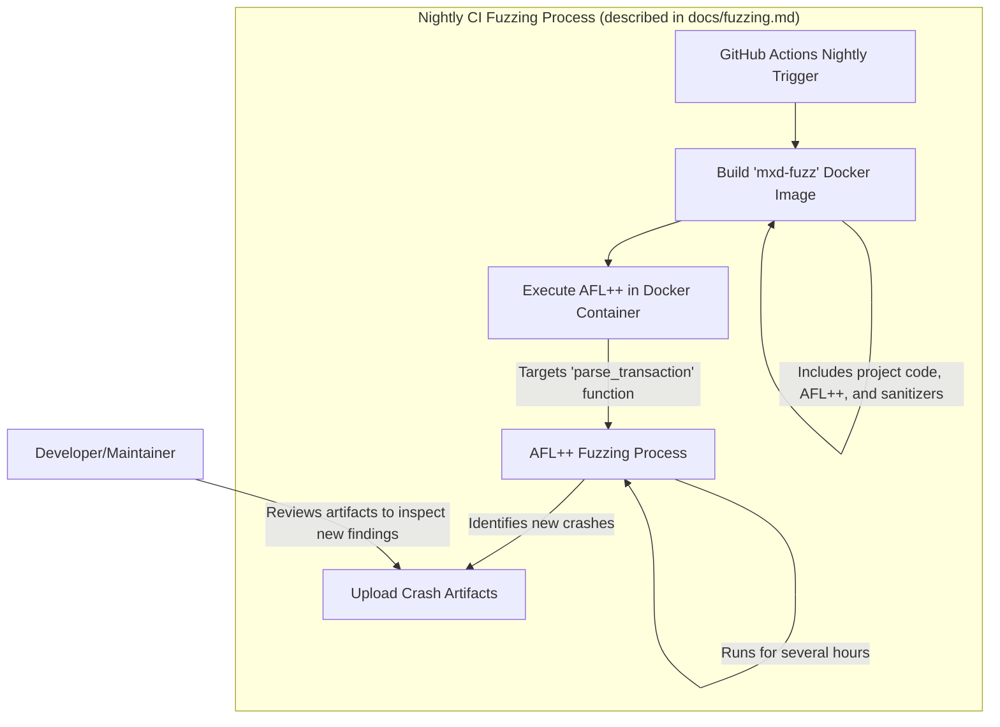

# AFL++ Fuzzing Guide

This document summarizes how to build and run the fuzzing harness for `mxd` and how it integrates with CI.

## Building the Harness

The fuzzing code lives in `fuzz/` and targets the `parse_transaction` function. Seed inputs are generated using `src/bin/gen_corpus.rs`, which constructs transactions defined in [docs/protocol.md](protocol.md).

```bash
# rebuild the seed corpus from the protocol examples
make corpus

# instrument the harness with AFL++
export CC=afl-clang-fast
export CXX=afl-clang-fast++
cargo afl build --manifest-path fuzz/Cargo.toml
```

## Running AFL++

Once compiled, invoke AFL++ with a directory of seed files:

```bash
mkdir -p fuzz/corpus findings
cargo afl fuzz -i fuzz/corpus -o findings fuzz/target/debug/fuzz
```

The harness panics on parsing errors so crashes will be detected. Refer to `file-sharing-design.md` for how file operations interact with the protocol.

### Docker

`fuzz/Dockerfile` builds the harness with sanitizers and runs AFL++ inside the official container. Use it when you want a reproducible environment:

```bash
# build the image
docker build -t mxd-fuzz -f fuzz/Dockerfile .

# run with mounted corpus and output directory
mkdir -p fuzz/corpus artifacts
docker run --rm \
  -v $(pwd)/fuzz/corpus:/corpus \
  -v $(pwd)/artifacts:/out \
  mxd-fuzz
```

## CI Integration

GitHub Actions runs the fuzzer nightly. The workflow defined in `.github/workflows/fuzz.yml` builds the Docker image, executes AFL++ for several hours and uploads any crashes. Review the artifacts after each run to inspect new findings. This process aligns with the overall architecture outlined in [roadmap.md](roadmap.md) and the storage notes in [file-sharing-design.md](file-sharing-design.md).


