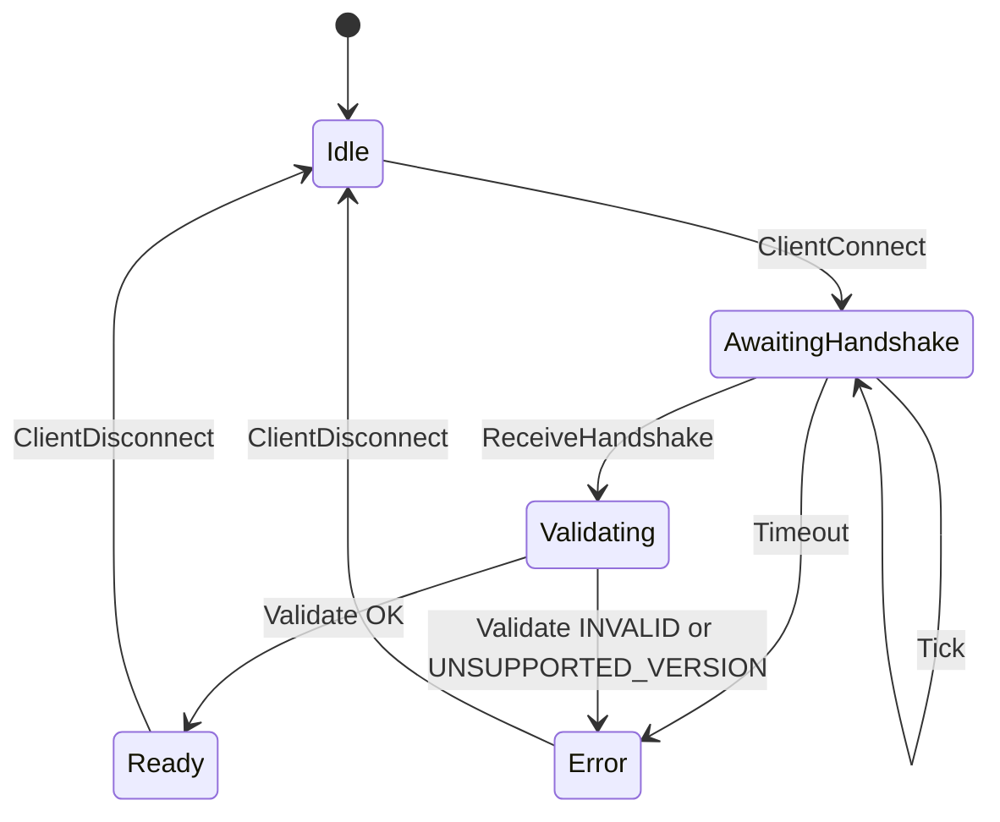
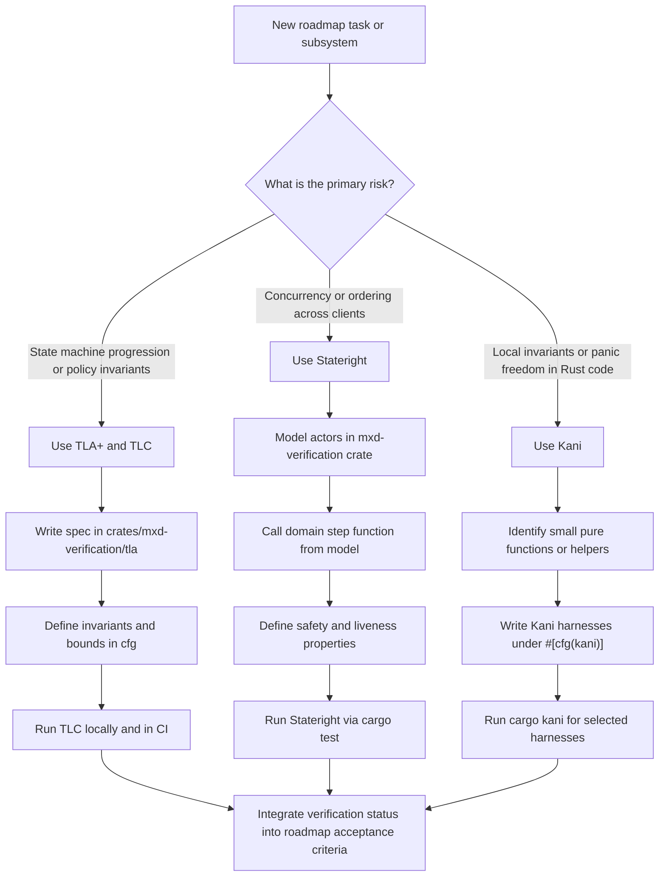

# Verification strategy

This document describes how mxd verifies correctness-critical behaviour with
Temporal Logic of Actions (TLA+) and the TLA+ Model Checker (TLC), the
Stateright model checker, and the Kani bounded verifier for Rust. It
complements `docs/design.md` and the wireframe migration plans by describing
the boundary between domain logic and adapters and by making verification a
deliverable of each roadmap step.

## Goals and scope

- Treat verification as a first-class deliverable alongside implementation.
- Exhaustively explore domain state transitions and concurrency interleavings.
- Pin protocol invariants such as handshake gating, privilege enforcement,
  drop box hiding, and news threading consistency.
- Keep verification artefacts co-located with code and easy to run locally.

Non-goals:

- Prove performance targets, throughput, or database liveness.
- Model external services in detail beyond their adapter contracts.

## Verification boundaries

Verification assumes the domain core is expressed as a deterministic transition
system:

- Server-wide and per-session state, captured in `DomainState`.
- `DomainEvent` for semantic inputs.
- Semantic outputs represented by `DomainEffect`.
- Pure transitions via `step(state, event) -> (state', effects)`.

Adapters (wireframe framing, persistence, object storage) translate between I/O
and the domain. This keeps verification focused on semantics rather than
transport details.

## Tooling layers

### TLA+/TLC

TLA+ expresses high-level behaviour and invariants with a small state model.
The TLC model checker explores finite configurations and produces
counterexample traces.

Use TLA+ when:

- verifying state-machine progression (handshake -> login -> online),
- specifying permissions and visibility rules, and
- checking sequencing and threading invariants in news and file flows.

Specs live under `crates/mxd-verification/tla/` with a `.tla` and matching
`.cfg` file per subsystem.

### Stateright

Stateright model-checks executable Rust actors and can share types with the
domain crate. Use it to explore interleavings of multiple clients, retries, and
out-of-order delivery.

Use Stateright when:

- concurrency or ordering matters (presence updates, chat, file uploads),
- domain logic must remain deterministic under reordering, and
- effects must be gated by authentication or privileges.

Models live in `crates/mxd-verification/` and call the domain `step` function
directly. Properties should assert both state invariants and effect safety.

### Kani

Kani is a bounded verifier for Rust. Use it for small, pure functions with
clear preconditions and invariants.

Use Kani when:

- validating codecs, parsers, and parameter encoders,
- proving pointer-like linkage updates (news threading), and
- locking down permission table mapping and predicate logic.

Harnesses live adjacent to the code they verify and compile only under
`#[cfg(kani)]`.

Current harnesses cover transaction framing invariants in
`src/transaction/reader/kani.rs`, `src/wireframe/codec/kani.rs`, and
`src/header_util/kani.rs`, proving header validation, fragment sizing, and
transaction ID echoing for bounded payloads.

## TLA+ specifications

### Handshake specification (MxdHandshake.tla)

The handshake spec models the server-side state machine for client connections.
It verifies:

- Error codes correctly map to validation failures (INVALID,
  UNSUPPORTED_VERSION, TIMEOUT)
- TIMEOUT error code implies timeout condition (ticks elapsed >= threshold)
- Ready state is only reachable with valid protocol ID and supported version
- Ready and Error states are mutually exclusive

The specification uses discrete time ticks rather than real time to abstract
timing while preserving timeout semantics. With `MaxClients = 3` and
`TimeoutTicks = 5`, TLC explores approximately 10⁶ states.

For screen readers: The following state diagram illustrates the handshake state
machine modelled in `MxdHandshake.tla`.



*Figure 1: Handshake state machine. Connections begin in Idle and transition
through AwaitingHandshake and Validating to reach either Ready (success) or
Error (invalid protocol, unsupported version, or timeout). Terminal states
return to Idle on disconnect.*

Run locally with:

```sh
make tlc-handshake
```

The script pulls `ghcr.io/leynos/mxd/mxd-tlc:latest` automatically. For local
development with a modified Dockerfile, build and use a local image:

```sh
docker build -t mxd-tlc -f crates/mxd-verification/Dockerfile .
TLC_IMAGE=mxd-tlc make tlc-handshake
```

## Deliverables and workflow

Each implementation step in `docs/roadmap.md` includes an explicit verification
deliverable. Choose the tool that best matches the risk:

- TLA+ for abstract state machines and policy invariants.
- Stateright for executable models and interleavings.
- Kani for sharp, local invariants and panic freedom.

Any counterexample trace should become a regression test that replays the
failing sequence through the domain `step` function.

For screen readers: The following flowchart outlines the decision path for
choosing TLA+/TLC, Stateright, or Kani for a new roadmap task.



## Continuous integration

The continuous integration (CI) pipeline runs a fast verification subset on
every pull request:

- Stateright models with conservative bounds,
- the highest-value Kani harnesses, and
- TLC checks for the most critical specs.

Nightly jobs run deeper bounds and the full verification set. Failures should
publish counterexample artefacts for triage.

## Running locally

```sh
# TLC via Makefile (pulls ghcr.io image automatically)
make tlc-handshake

# TLC via Docker directly
./scripts/run-tlc.sh crates/mxd-verification/tla/MxdHandshake.tla

# Stateright models (bounded)
cargo test -p mxd-verification -- --nocapture

# Kani harnesses (transaction framing invariants)
cargo kani -p mxd --harness kani_validate_header_matches_predicate
cargo kani -p mxd --harness kani_fragment_ranges_cover_payload
cargo kani -p mxd --harness kani_validate_first_header_matches_predicate
cargo kani -p mxd --harness kani_validate_continuation_frame_matches_predicate
cargo kani -p mxd --harness kani_reply_header_echoes_id
```
